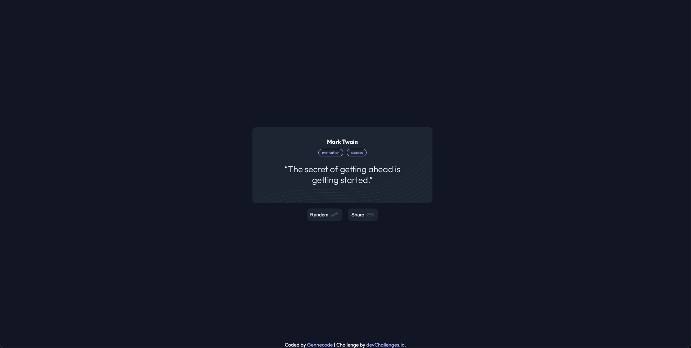

<!-- Please update value in the {}  -->

<h1 align="center">Random Quote Challenge | devChallenges</h1>

   Solution for a challenge <a href="https://devchallenges.io/challenge/random-quote" target="_blank">Random Quote
</a> from <a href="http://devchallenges.io" target="_blank">devChallenges.io</a>.

  <h3>
    <a href="{https://your-demo-link.your-domain}">
      Demo
    </a>
     | 
    <a href="https://github.com/tjaulin/random-quote-challenge">
      Solution
    </a>
     | 
    <a href="https://devchallenges.io/challenge/random-quote">
      Challenge
    </a>
  </h3>

<!-- TABLE OF CONTENTS -->

## Table of Contents

- [Overview](#overview)
- [Built with](#built-with)
- [Features](#features)
- [Contact](#contact)
- [Author](#author)

<!-- OVERVIEW -->

## Overview

### Built with

- Semantic HTML5 markup
- CSS custom properties
- Flexbox

## Features

This application/site was created as a submission to a [DevChallenges](https://devchallenges.io/challenges-dashboard) challenge.

## Author

- Website [your-website.com](https://mes-projets.vercel.app)
- GitHub [@tjaulin](https://github.com/tjaulin)
